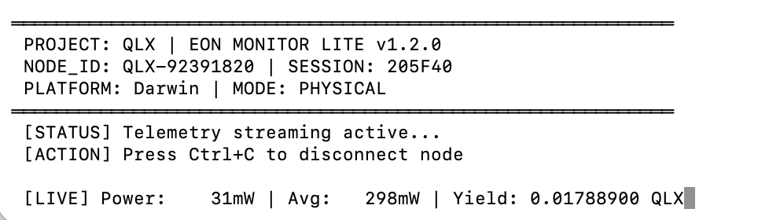

# Project: QLX (EON Monitor Lite)

**The Fuel for Intelligence: Bridging Green Energy and Verifiable Compute.**



---

## 🚀 Overview: The Global Energy-Compute Nexus

**Project: QLX** is the open-source foundation for the **QLX EON Nexus**—a vision to create a decentralized, asset-backed infrastructure that transforms globally stranded or underutilized green energy into the most scarce asset of the AI era: **verifiable green compute**.

The **EON Monitor Lite** is the first public component of this vision. It is a high-precision telemetry tool designed to measure the real-time energy consumption of your local machine and calculate its potential **Compute-Value (Valor)** within the future QLX ecosystem.

### Why This Matters

The AI industry faces a critical bottleneck:

1. **Energy Crisis**: AI's insatiable demand for power is driving up carbon emissions, contradicting global ESG goals.

1. **Resource Misallocation**: Vast amounts of green energy (e.g., wind/solar curtailment) are wasted due to grid limitations, while AI compute remains centralized and expensive.

**EON Monitor Lite** demonstrates the core principle: **Every Watt of Green Energy is a Potential Unit of Compute.**

---

## ✨ Features

| Feature | Description | Strategic Value |
| --- | --- | --- |
| **Physical Precision** | Direct reading of CPU/GPU power consumption in **milliwatts (mW)** on Apple Silicon (M1/M2/M3). | **Investor-Ready**: Proves the ability to anchor digital value to real-world physics. |
| **Cross-Platform Support** | Load-based simulation for Windows and Linux, ensuring broad community adoption. | **Scalability**: Demonstrates the potential for a truly global, decentralized network (DePIN). |
| **Real-Time Valor Calculation** | Converts energy consumption into a quantifiable **QLX Yield** (simulated). | **Monetization**: Establishes the fundamental economic model of the Nexus. |
| **Industrial Architecture** | Modular design with external configuration (`config.json`), signaling a production-ready approach. | **Talent Attraction**: Appeals to senior engineers looking for a well-structured, scalable project. |

---

## 🛠️ Quick Start Guide

### Prerequisites

1. Python 3.8+

1. `pip3 install psutil`

1. **(For macOS Users)**: Administrative privileges (`sudo`) are required for `powermetrics` to read physical power data.

### Installation & Run

1. **Clone the Repository:**

   ```bash
   git clone https://github.com/your-github-username/project-qlx.git
   cd project-qlx
   ```

1. **Install Dependencies:**

   ```bash
   pip3 install -r requirements.txt
   ```

   *(Note: A **`requirements.txt`** file should be created containing **`psutil`** )*

1. **Run the Monitor:**

   ```bash
   # For macOS (Physical Power Reading)
   sudo python3 eon_monitor_lite.py
   
   # For Windows/Linux (Load Simulation)
   python3 eon_monitor_lite.py
   ```

### Configuration (Optional)

The monitor loads settings from `config.json`. You can create this file based on `config.json.example` to customize parameters like `UPLINK_URL` (for future integration) and `NODE_ID`.

---

## 🤝 Join the Nexus: We're Building the Future

This project is currently in its **Phase Alpha (Community Edition)**. We are actively seeking:

### 1. **Founding CTO (Equity Partner)**

We are looking for a visionary technologist to lead the development of the **QLX Core Protocol** (Layer 1/Layer 2 integration, Smart Contracts, and the proprietary **CEE Index** algorithm). If you have deep experience in DePIN, distributed systems, or RWA tokenization, this is a **civilization-level opportunity**.

**[Contact: **[HEX [Project:QLX]](mailto:hexagon.warrior2025@gmail.com)**]**

### 2. **Community Contributors**

We welcome contributions to:

- Adding physical power reading support for Linux/Windows GPUs (e.g., NVIDIA/AMD APIs).

- Improving the cross-platform simulation accuracy.

- Developing a simple GUI wrapper.

---

## ⚖️ License

This project is released under the **AGPL-3.0 License**.

---

## 🌐 The QLX EON Nexus (Future Vision)

The EON Monitor Lite is just the beginning. The full **QLX EON Nexus** will be a global decentralized network that:

- Tokenizes energy assets into QLX.

- Provides verifiable, green compute to AI labs and cloud providers.

- Establishes the **CEE Index** as the global standard for green compute efficiency.

**Join us in fueling the next generation of intelligence.**

